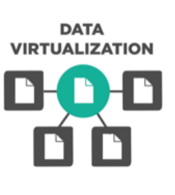

```{r setup, include=FALSE}
# global settings
knitr::opts_chunk$set(echo = FALSE)
# packages used for this presentation
pkgs <- c("knitr", "rmarkdown")
knitr::write_bib(pkgs, "packages.bib", prefix = "")
```


## {data-background=white .centered}

<div class="columns-2">

{width=70%K}
{width=70%K}
{width=70%}

<p class="forceBreak"></p>

**Terrell Russell - Executive Director**    

{width=40%}     
**Kory Draughn - Chief Technologist**  

{width=40%}       

*And a long list of current and former team members as well as outside collaborators.*

</div>

## {data-background=images/network-overview.png data-background-size=cover}

## What is iRODS

- **Distributed**
  + Runs on a laptop, a cluster, on premises or geographically distributed

- **Open Source** 
  + BSD-3 Licensed, install it today and try before you buy
  
- **Data Centric & Metadata Driven**
  + Insulate both your user and your data from your infrastructure
  
## iRODS as the Integration Layer {data-background=images/integration_layer.png data-background-size=70%}

## iRODS Core Competencies {data-background=images/core_comps.png data-background-size=50%}

## Data Virtualization {data-background=white}

<div class="columns-2">
  <center>
    {width=50%}
  </center>

<p class="forceBreak"></p>

Combine various distributed storage technologies into a Unified Namespace

- Existing file systems
- Cloud storage
- On premises object storage
- Archival storage systems

*iRODS provides a logical view into the complex physical representation of your data, distributed geographically, and at scale*
</div>

## Projection of the Physical into the Logical {data-background=images/virtual_fsystem.png data-background-size=70%}

## Data Discovery {data-background=white}

<div class="columns-2">
  <center>
    {width=50%}
  </center>

<p class="forceBreak"></p>

Attach metadata to any first class entity within the iRODS Zone

- Data Objects
- Collections
- Users
- Storage Resources
- The Namespace

*iRODS supports automated and user-provided metadata which makes your data and infrastructure more discoverable, operational, and valuable*
</div>

## Metadata Everywhere {data-background=images/meta-data.png data-background-size=68%}

## References